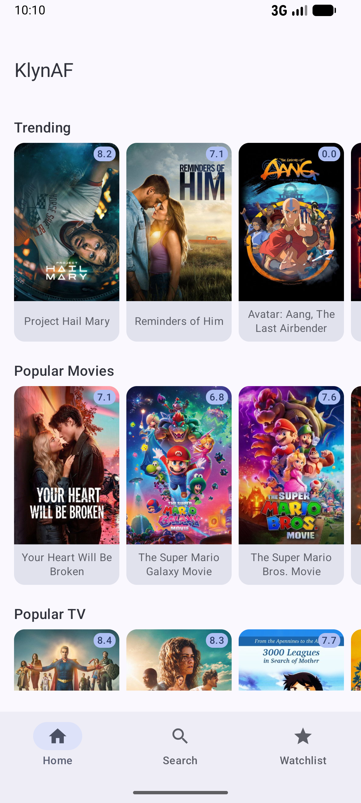
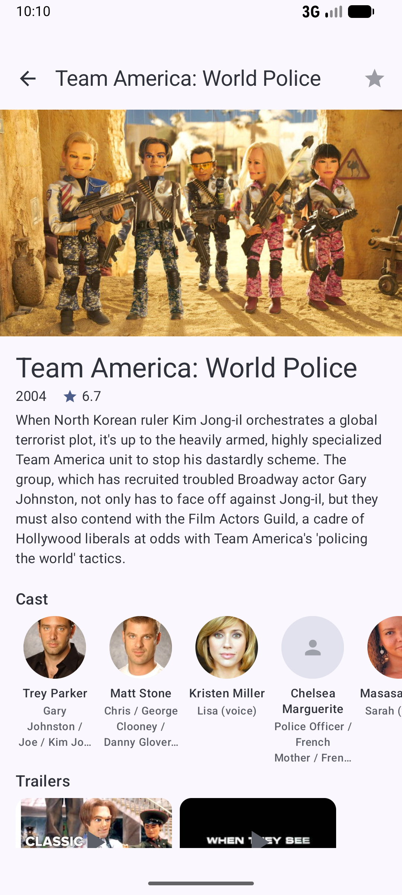
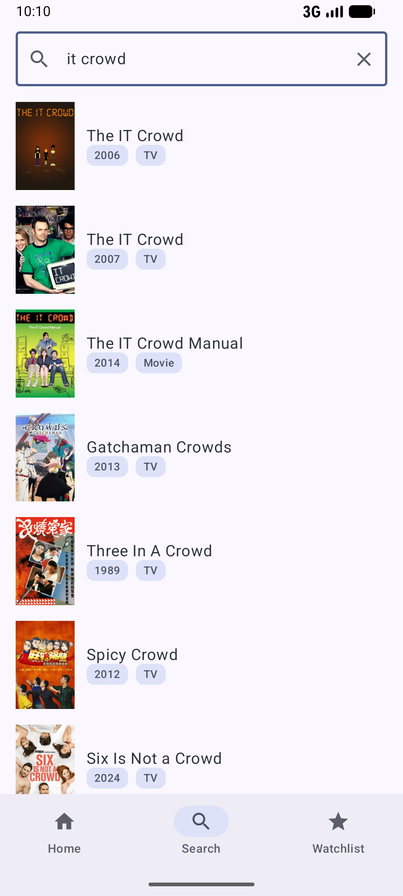
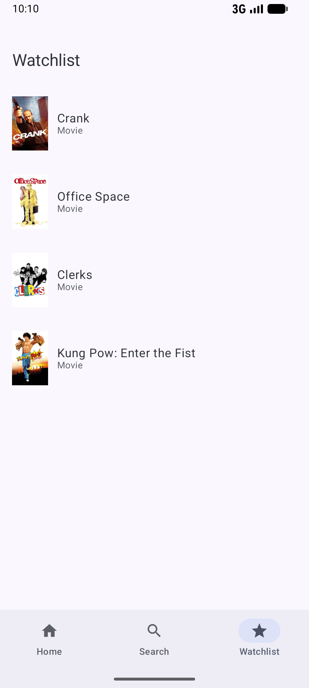
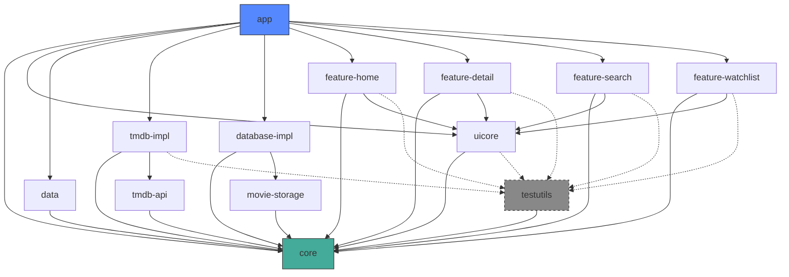

# KlynAF (Klyn Architecture Framework)

A multi-module Android app built on top of
the [TMDB API](https://developer.themoviedb.org/docs/getting-started).

The main goal of the project is to showcase how a modular Android codebase can stay organized as it
grows: strict layer separation, unidirectional data flow, feature isolation, and a test suite that
actually covers the ViewModels and data sources. Nothing groundbreaking, just a solid foundation you
can point at and say *"yeah, that's how I'd structure it."*

---

## Screenshots

<p align="center">
  &nbsp;&nbsp;&nbsp;
</p>

---

## API Key

The app talks to TMDB, so you'll need an API key. Grab one
from [themoviedb.org](https://www.themoviedb.org/settings/api) (it's free) and drop it into
`local.properties` at the project root:

```properties
tmdb_api_key=YOUR_API_KEY_HERE
```

Without this the app will build fine but every network request will come back `401 Unauthorized`.

---

## Build & Run

Open the project in Android Studio or use the command line:

```bash
# Build the debug APK
./gradlew assembleDebug

# Install and launch on a connected device / emulator
./gradlew installDebug
```

**Requirements:** JDK 21, Android SDK 36 (min SDK 26).

---

## Running Tests

```bash
# Run all unit tests across every module
./gradlew test

# Run tests for a specific module
./gradlew :feature-detail:test
./gradlew :feature-home:test
./gradlew :feature-search:test
./gradlew :feature-watchlist:test
./gradlew :tmdb-impl:test
./gradlew :uicore:test
```

Tests use JUnit 6 + MockK + Turbine. Each feature module and `tmdb-impl` have their own test suites;
shared test infrastructure (like the `UnconfinedTestDispatcherExtension`) lives in `:testutils`.

---

## Module Dependency Graph



**Quick overview of each module:**

| Module              | What it does                                                                                                 |
|---------------------|--------------------------------------------------------------------------------------------------------------|
| `app`               | Hilt entry point, `MainActivity`, bottom navigation, nav graph                                               |
| `core`              | Domain models, repository & data source interfaces, `Result` type                                            |
| `data`              | Repository implementations, Hilt bindings for repositories                                                   |
| `tmdb-api`          | Retrofit service interfaces and Moshi DTOs for TMDB                                                          |
| `tmdb-impl`         | Network setup (OkHttp, Retrofit, auth interceptor), remote data source implementations, DTO → domain mappers |
| `movie-storage`     | Room entities, DAOs, type converters                                                                         |
| `database-impl`     | Room database instance, local data source implementation, Hilt bindings                                      |
| `uicore`            | Shared Compose components (shimmer, error/empty states, media cards), theme, image URL builder               |
| `feature-home`      | Home screen — trending, popular movies/TV, top rated                                                         |
| `feature-detail`    | Detail screen — backdrop, overview, cast, trailers, similar titles, watchlist toggle                         |
| `feature-search`    | Multi-search with debounce, mixed movie + TV results                                                         |
| `feature-watchlist` | Local watchlist backed by Room, swipe-to-dismiss                                                             |
| `testutils`         | Shared test helpers (`UnconfinedTestDispatcherExtension`)                                                    |

---

## Tech Stack

| Layer         | Libraries                                             |
|---------------|-------------------------------------------------------|
| UI            | Jetpack Compose, Material 3, Coil, Navigation Compose |
| DI            | Hilt                                                  |
| Network       | Retrofit, OkHttp, Moshi                               |
| Local storage | Room                                                  |
| Async         | Kotlin Coroutines + Flow                              |
| Testing       | JUnit 6, MockK, Turbine, Coroutines Test              |
| Build         | Gradle version catalogs, AGP 9.1                      |
